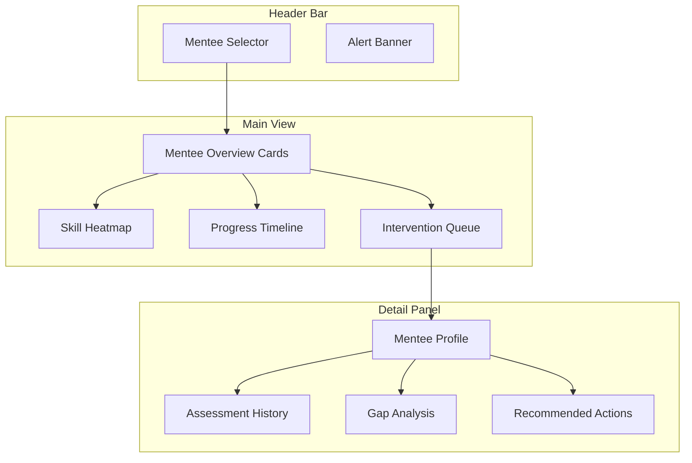

# Mentor Dashboard

> Centralized interface for mentors to monitor, guide, and support their mentees' capability development journeys.

## Overview

The Mentor Dashboard provides mentors with a comprehensive view of their mentees' progress, skill development, engagement patterns, and intervention opportunities. It surfaces actionable insights while respecting privacy boundaries.

## Dashboard Layout

## Key Features

| Feature | Description |
|---|---|
| **Mentee Overview** | At-a-glance cards showing progress, engagement, and alerts per mentee |
| **Skill Heatmap** | Capability density visualization across the mentee group |
| **Progress Timeline** | Individual and aggregate growth trajectories over time |
| **Intervention Queue** | Prioritized list of mentees needing attention |
| **Gap Analysis** | Common capability gaps across the mentee group |
| **Action Recommender** | Suggested mentoring activities based on data patterns |

## Alert Types

| Alert | Trigger | Suggested Action |
|---|---|---|
| **Stalled Progress** | No improvement over 30 days | Schedule check-in, adjust learning plan |
| **Engagement Drop** | Activity frequency below threshold | Reach out, identify blockers |
| **Confidence Low** | Assessment confidence below threshold | Recommend re-assessment or practice |
| **Skill Decay** | Capability score decaying significantly | Recommend refresher activities |
| **Achievement Milestone** | Major accomplishment unlocked | Recognize and encourage |

## Related Documents

- [AI Mentor](ai-mentor.md)
- [Analytics](analytics.md)
- [Behavior Tracking](behavior-tracking.md)
- [Progress Engine](progress-engine.md)
