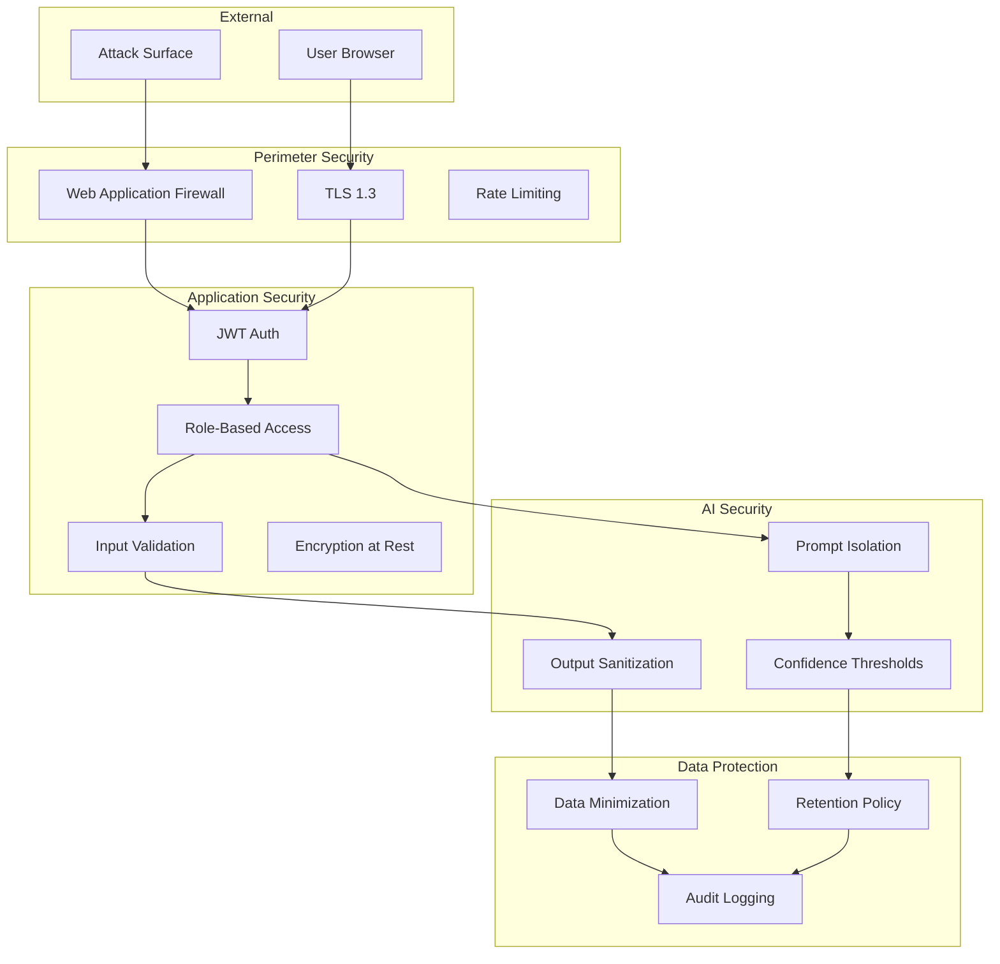
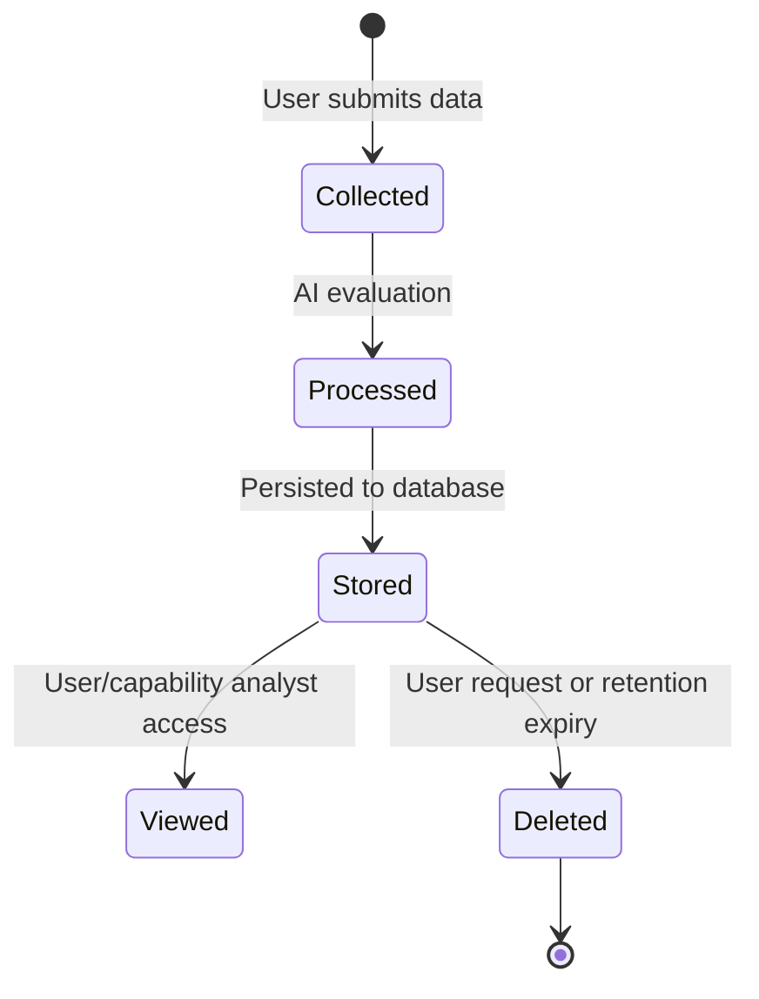
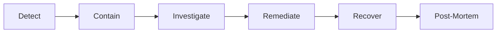

# PWNDORA SkillScan X — Privacy & Security Model

> Data protection, privacy controls, and security architecture.

---

## Purpose

This document defines the privacy and security model governing PWNDORA SkillScan X. The platform processes assessment responses, capability profiles, and personally identifiable information. Every data point requires protection, clear handling policy, and transparent disclosure to users.

---

## Security Architecture

---

## Privacy Principles

| Principle | Implementation |
|---|---|
| **Data Minimization** | Only store data required for assessment: transcripts, scores, user profile |
| **Purpose Limitation** | Assessment data used only for capability evaluation and learning recommendations |
| **Transparency** | Users can view all stored data associated with their account |
| **User Control** | Users can delete reports and request account deletion |
| **No Voice Retention** | Voice recordings are not retained; transcription text only |

---

## Data Classification

| Classification | Examples | Protection |
|---|---|---|
| **Public** | Platform documentation, feature descriptions | No restrictions |
| **Internal** | Architecture docs, non-personal metrics | Access control |
| **Confidential** | Assessment scores, capability profiles | Encryption, access control |
| **Restricted** | Credentials, API keys, authentication secrets | Encryption, never in code |

---

## Security Controls

### Authentication & Authorization

| Control | Implementation |
|---|---|
| Password hashing | bcrypt with cost factor 12 |
| Session tokens | JWT (HS256, 24-hour expiry) |
| Token storage | HTTP-only cookies (frontend), environment variables (backend) |
| Rate limiting | 5 attempts/minute on auth endpoints |
| Role enforcement | Server-side check on all protected endpoints |

### AI Security

| Control | Implementation |
|---|---|
| Prompt injection mitigation | Input validation, prompt isolation per agent, output sanitization |
| Data leakage prevention | No PII in AI prompts; anonymized professional responses |
| Hallucination containment | Rubric-first evaluation constrains LLM to evidence generation |

### Infrastructure Security

| Control | Implementation |
|---|---|
| HTTPS | TLS termination at reverse proxy |
| Secrets management | Environment variables; `.env` excluded from version control |
| Container security | Non-root user in Docker; minimal base image |
| CORS | Whitelist specific origins; no wildcard in production |

---

## Data Lifecycle

### Retention

| Data Type | Retention Period | Rationale |
|---|---|---|
| Assessment transcripts | Indefinite (user active) | Required for evidence traceability |
| Evaluation scores | Indefinite (user active) | Required for Cyber Twin and growth tracking |
| User profile | Until account deletion | Account management |
| Voice recordings | Not retained | Transcription only |
| Audit logs | 12 months | Security and compliance |
| Session tokens | 24 hours | Token expiry |

### Deletion

| Action | Scope | Recovery |
|---|---|---|
| Report deletion | Single assessment report | Irreversible |
| Account deletion | All user data | Irreversible after grace period |
| Data export | All user data in JSON | N/A |

---

## Compliance Alignment

| Framework | Alignment Status | Notes |
|---|---|---|
| OWASP Top 10 | Designed for alignment | Web security best practices |
| MITRE ATT&CK | Implemented | Assessment mapping context |
| NICE NIST SP 800-181 | Implemented | Role and capability framework |
| WCAG 2.1 AA | Design target | Accessibility compliance |

---

## Incident Response

### Response Procedure

| Phase | Actions | Timeline |
|---|---|---|
| Detect | Monitor alerts, user reports, anomaly detection | Immediate |
| Contain | Isolate affected systems, revoke compromised credentials | < 15 minutes |
| Investigate | Determine scope, root cause, data affected | < 4 hours |
| Remediate | Apply fixes, rotate secrets, patch vulnerabilities | < 24 hours |
| Recover | Restore services, verify integrity | < 4 hours |
| Post-Mortem | Document incident, update procedures, implement preventive measures | < 1 week |

---

## Related Documents

| Document | Location |
|---|---|
| Security Architecture | `../07-engineering/35-security-architecture-deep-dive.md` |
| Authentication & Authorization | `../05-data-api/24-authentication-authorization.md` |
| Data Models | `../05-data-api/25-data-models.md` |
| Glossary | `../reference/glossary.md` |
