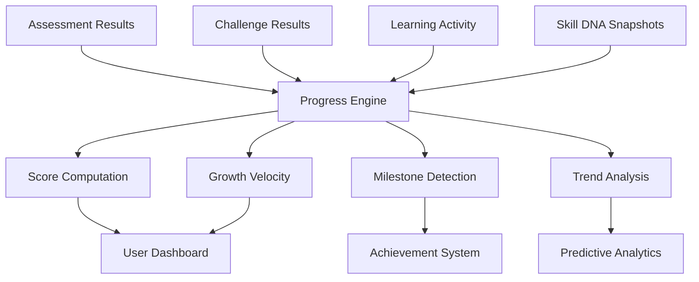

# Progress Engine

> Central tracking and reporting system that monitors capability development across all activities, computes growth metrics, and generates progress reports.

## Overview

The Progress Engine is the measurement backbone of the platform. It ingests data from every assessment, challenge, and learning activity — computing growth trajectories, milestone achievements, and progress velocity across all capability dimensions.

## Progress Computation

## Key Metrics

| Metric | Description | Computation |
|---|---|---|
| **Current Score** | Latest capability estimate | Bayesian update from all evidence |
| **Growth Velocity** | Rate of score change over time | Linear regression over score history |
| **Progress %** | Completion toward current goal | Current / Target score ratio |
| **Time to Target** | Estimated time to reach goal score | Score gap / Growth velocity |
| **Streak Length** | Consecutive days with activity | Date sequence counting |

## Progress Reporting

Reports are generated at multiple levels:
- **Individual**: Personal progress dashboard with goal tracking
- **Mentor**: Mentee group progress overview with intervention triggers
- **Team**: Aggregate team capability growth tracking
- **Organization**: Workforce capability development trends

## Related Documents

- [Analytics](analytics.md)
- [Gamification](gamification.md)
- [Achievements](achievements.md)
- [Learning Path Engine](learning-path-engine.md)
