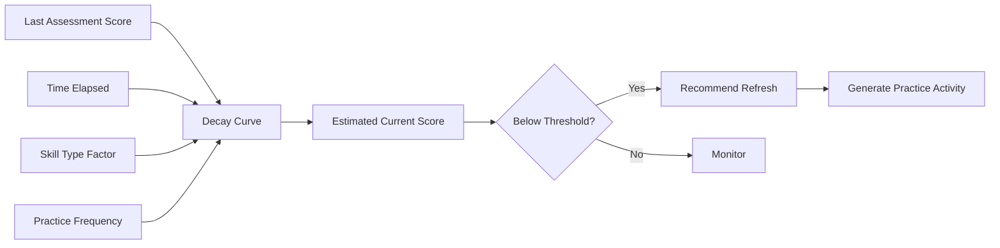

# Skill Decay

> Modeling the natural attrition of capabilities over time without practice or application, and the platform's strategy for detecting and managing it.

## Overview

Skills are not static — they degrade without use. Skill Decay modeling enables the platform to estimate current capability levels even between assessments, prompting timely re-evaluation and recommending practice activities to maintain proficiency.

## Decay Model

## Decay Parameters

| Parameter | Description | Default |
|---|---|---|
| **Half-Life** | Time for score to decay 50% without practice | Varies by skill type |
| **Practice Reset** | Full restoration of score with successful practice | Immediate |
| **Minimum Floor** | Lowest score a skill can decay to | 15% of max |
| **Skill Type Factor** | Differential decay rates by skill category | Knowledge: 90d, Technical: 60d, Soft: 120d |

## Decay Rates by Skill Category

| Category | Half-Life | Example Skills |
|---|---|---|
| **Declarative Knowledge** | 90-120 days | Concepts, frameworks, regulations |
| **Procedural Skills** | 60-90 days | Coding, configuration, tool use |
| **Analytical Skills** | 45-60 days | Threat modeling, incident response |
| **Soft Skills** | 120-180 days | Communication, leadership |
| **Muscle Memory** | 30-45 days | Keyboard shortcuts, tool fluency |

## Related Documents

- [Confidence Tracking](confidence-tracking.md)
- [Capability Assessment Engine](../docs/06-ai-engines/27-capability-assessment-engine.md)
- [Learning Path Engine](learning-path-engine.md)
- [Progress Engine](progress-engine.md)
