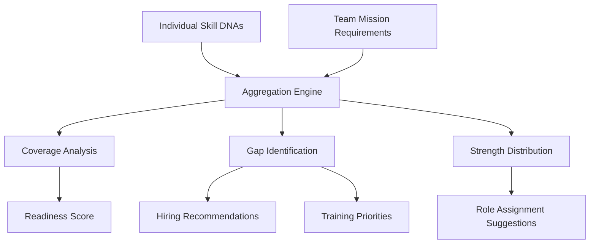

# Team Assessment

> Aggregate evaluation of team-level capability strength, composition, and readiness for specific missions or organizational objectives.

## Overview

Team Assessment extends individual capability intelligence to the team level. It evaluates collective skill coverage, identifies capability gaps critical to team objectives, and recommends composition or development actions.

## Team Analysis Model

## Team Metrics

| Metric | Description |
|---|---|
| **Coverage %** | Percentage of required skills adequately covered by team members |
| **Depth Score** | Aggregate proficiency level across all required capabilities |
| **Redundancy Index** | Number of team members with coverage for each critical skill |
| **Gap Criticality** | Impact of each skill gap on mission success |
| **Readiness Score** | Composite readiness to take on specific missions or objectives |

## Visualization

The Team Assessment is visualized through:
- **Team Capability Radar**: Multi-axis spider chart comparing team vs. requirements
- **Coverage Matrix**: Skills × Members heatmap showing who covers what
- **Gap Impact Chart**: Prioritized gap list weighted by mission criticality
- **Composition View**: Distribution of proficiency levels across the team

## Related Documents

- [Community Intelligence](community-intelligence.md)
- [Capability Heatmap](capability-heatmap.md)
- [Benchmarking](benchmarking.md)
- [Analytics](analytics.md)
