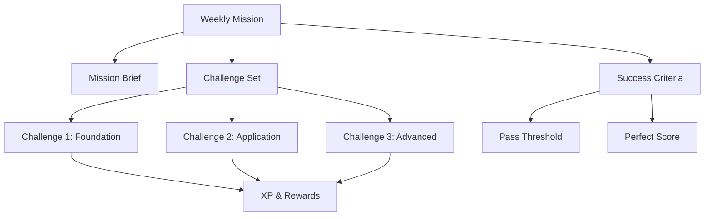

# Weekly Missions

> Curated, time-boxed challenge sets that focus on specific skill areas, providing structured practice and assessment opportunities.

## Overview

Weekly Missions provide a cadenced approach to capability development. Each mission is a curated collection of challenges focused on a specific skill area, designed to be completable within a week with reasonable time investment.

## Mission Structure

## Mission Design Principles

| Principle | Description |
|---|---|
| **Themed Focus** | Each mission targets a specific skill cluster or capability area |
| **Progressive Difficulty** | Challenges within a mission ramp from foundation to advanced |
| **Time-Boxed** | Designed for 3-5 hours total, completable in a week |
| **Evidence-Rich** | Each challenge produces assessable capability evidence |
| **Streak-Compatible** | Completing weekly missions builds and maintains streaks |

## Mission Types

| Type | Focus | Frequency |
|---|---|---|
| **Skill Builder** | Specific capability development | Weekly |
| **Challenge Week** | Mixed challenge set for broad assessment | Bi-weekly |
| **Boss Mission** | Major integrated challenge | Monthly |
| **Cyber Season Event** | Themed seasonal missions | Quarterly |

## Related Documents

- [Gamification](gamification.md)
- [Cyber Seasons](cyber-seasons.md)
- [Achievements](achievements.md)
- [Practical Challenge Engine](../docs/06-ai-engines/28-practical-challenge-engine.md)
