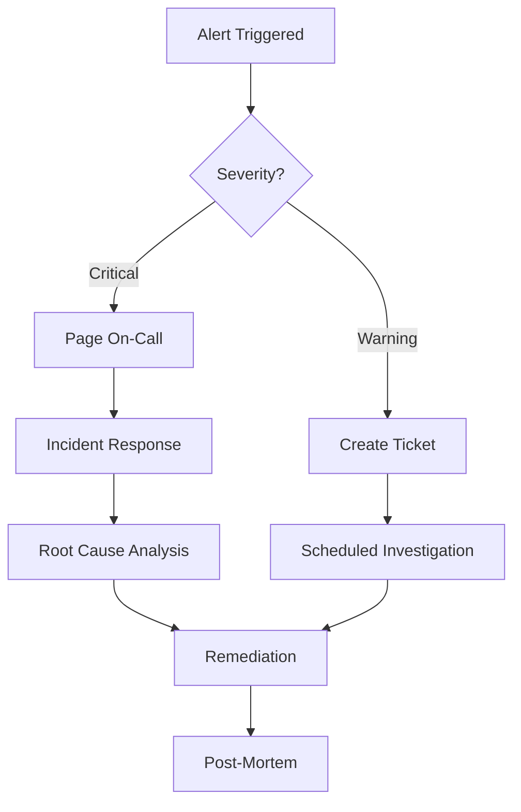

# Monitoring

> Real-time and historical monitoring infrastructure for detecting, alerting, and diagnosing issues across the platform.

## Overview

Monitoring provides continuous surveillance of platform health, performance, and user experience. It encompasses infrastructure monitoring, application performance monitoring (APM), user experience monitoring, and business metric monitoring.

## Monitoring Stack

| Layer | Tool | Purpose |
|---|---|---|
| **Infrastructure** | Prometheus + Node Exporter | Server, container, and network metrics |
| **Application** | OpenTelemetry + APM | Code-level performance and errors |
| **User Experience** | Real User Monitoring (RUM) | Client-side performance and errors |
| **Synthetic** | Synthetic transaction monitoring | Proactive availability testing |
| **Business** | Custom metrics pipeline | Assessment completion, user growth, engagement |

## Alert Types

| Alert | Severity | Threshold | Response |
|---|---|---|---|
| **Service Down** | Critical | 100% error rate | Page on-call |
| **High Error Rate** | Critical | >5% errors over 5 min | Page on-call |
| **Latency Degradation** | Warning | p95 > 2s baseline | Investigate next business day |
| **Capacity Warning** | Warning | Resource usage >80% | Auto-scale or provision |
| **Business Metric Drop** | Warning | Assessment completions drop 50% | Business team notification |

## Alert Response Flow

## Related Documents

- [Observability](observability.md)
- [Scalability](scalability.md)
- [Monitoring & Observability](../docs/07-engineering/34-monitoring-observability.md)
- [DevOps Architecture](../docs/07-engineering/32-devops-architecture.md)
