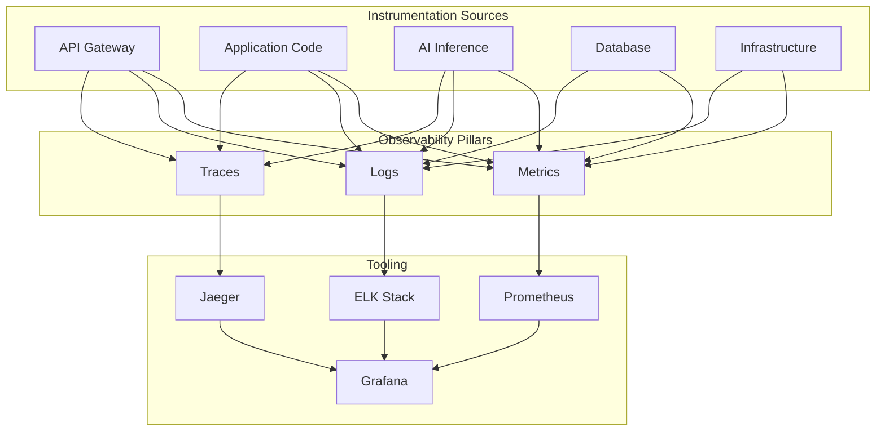

# Observability

> Comprehensive instrumentation, logging, tracing, and metrics collection for understanding system behavior in production.

## Overview

Observability enables operators and developers to understand the internal state of the system from its external outputs. The platform implements the three pillars of observability — metrics, logs, and traces — with structured instrumentation across all services.

## Three Pillars

## Instrumentation

| Component | Metrics | Logs | Traces |
|---|---|---|---|
| **API Gateway** | Request rate, latency, errors | Access logs | Request ID propagation |
| **Application** | Business metrics, throughput | Application logs | Span per operation |
| **AI Inference** | Inference time, token count | Model logs | Span per model call |
| **Database** | Query time, connection pool | Slow query log | DB call span |
| **Infrastructure** | CPU, memory, network | System logs | N/A |

## Key Dashboards

- **System Health**: Overall platform health, uptime, and incident status
- **API Performance**: Endpoint-level latency, error rates, and throughput
- **AI Pipeline**: Inference latency, queue depth, and model performance
- **User Impact**: Error rates affecting users, session health
- **Cost Monitoring**: Compute, storage, and AI inference costs

## Related Documents

- [Monitoring & Observability](monitoring.md)
- [Scalability](scalability.md)
- [DevOps Architecture](../docs/07-engineering/32-devops-architecture.md)
- [Monitoring & Observability](../docs/07-engineering/34-monitoring-observability.md)
