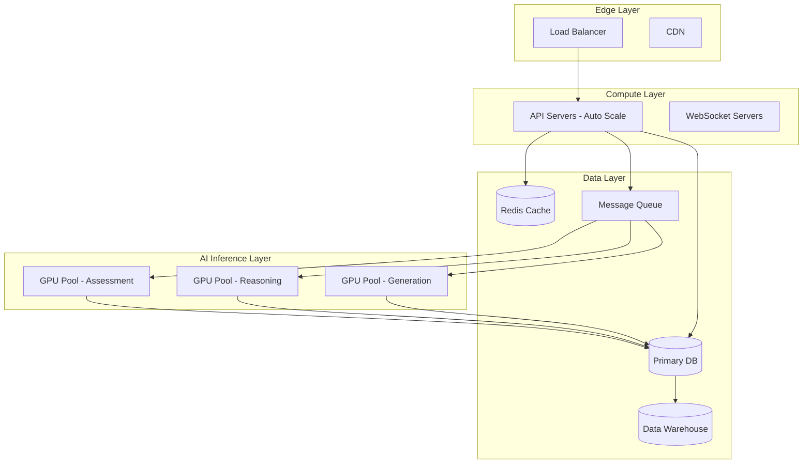

# Scalability

> Architecture and strategy for scaling the platform from individual users to enterprise deployments with thousands of concurrent assessments.

## Overview

Scalability is a first-class architectural concern. The platform is designed to handle linear growth across user count, assessment volume, concurrent sessions, and data storage without degradation in performance or user experience.

## Scaling Dimensions

| Dimension | Current Target | Future Target |
|---|---|---|
| **Concurrent Users** | 10,000 | 100,000 |
| **Assessments/Day** | 50,000 | 500,000 |
| **Data Storage** | 5 TB | 50 TB |
| **Org Tenants** | 100 | 1,000 |
| **AI Inference Latency** | < 2s | < 500ms |

## Architecture

## Scaling Strategies

| Strategy | Application |
|---|---|
| **Horizontal Scaling** | API servers, WebSocket servers |
| **Database Read Replicas** | Analytics queries, dashboard loads |
| **Sharding** | Per-org data partitioning |
| **Caching** | Assessment content, Skill DNA blueprints |
| **Async Processing** | AI inference via message queues |
| **Auto-scaling** | Compute resources based on load metrics |

## Related Documents

- [System Architecture](../docs/04-architecture/16-system-architecture.md)
- [Backend Architecture](../docs/04-architecture/18-backend-architecture.md)
- [Monitoring & Observability](monitoring.md)
- [Non-Functional Requirements](../docs/03-functional-design/11-non-functional-requirements.md)
