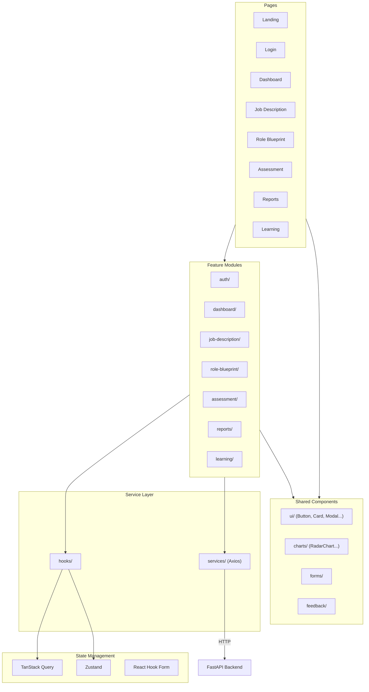

# AegisIQ — Frontend

> React SPA for explainable cybersecurity assessments.

[](https://react.dev)
[](https://typescriptlang.org)
[](https://vitejs.dev)
[](https://tailwindcss.com)

---

## Architecture



### Layered Architecture

```
Pages → Features → Components → Hooks → Services → API Client → Backend
```

Each layer has exactly one responsibility.

---

## Technology Stack

| Category | Technology |
|---|---|
| UI Framework | React 19 |
| Language | TypeScript 5 |
| Build Tool | Vite 6 |
| Styling | Tailwind CSS 4 |
| Routing | React Router 7 |
| Server State | TanStack Query 5 |
| Forms | React Hook Form 7 |
| Charts | Recharts 2 |
| Icons | Lucide React |
| HTTP Client | Axios |
| Global State | Zustand |
| Testing | Vitest, Playwright |

---

## Feature Modules

```
src/
├── app/                App entry, providers, router configuration
├── routes/             Route definitions (public, protected)
├── layouts/            Shared layouts (AuthLayout, DashboardLayout)
├── features/           Business feature modules
│   ├── auth/           Login, register, password reset
│   ├── dashboard/      Main dashboard, stats, recent activity
│   ├── job-description/    JD upload, parsing results
│   ├── role-blueprint/     Competency graph, blueprint review
│   ├── assessment/     Mission session, timer, voice recording
│   ├── reports/        Report viewer, export, evidence review
│   └── learning/       Learning roadmap, recommendations
├── components/         Shared UI component library
│   ├── ui/             Primitives (Button, Card, Input, Badge, Modal, Progress)
│   ├── charts/         Data viz (RadarChart, BarChart, LineChart)
│   ├── forms/          Reusable form components
│   └── feedback/       ErrorBoundary, Toast, Loading states
├── services/           Axios-based API client layer
├── hooks/              Shared custom hooks
├── lib/                Utility functions, helpers, constants
├── types/              TypeScript type definitions
├── assets/             Static assets (images, fonts)
└── styles/             Global styles, Tailwind config
```

Each feature module owns:
- Pages (screen-level components)
- Components (feature-specific UI)
- Hooks (feature-specific logic)
- Types (feature-specific types)
- Services (feature-specific API calls)
- Tests

---

## Routes

| Path | Feature | Access |
|---|---|---|
| `/` | Landing | Public |
| `/login` | Auth | Public |
| `/register` | Auth | Public |
| `/dashboard` | Dashboard | Protected |
| `/job-description` | JD Intelligence | Protected |
| `/role-blueprint/:id` | Role Blueprint | Protected |
| `/assessment/:id` | Assessment | Protected |
| `/assessment/:id/mission/:mid` | Mission | Protected |
| `/reports/:id` | Reports | Protected |
| `/learning` | Learning | Protected |
| `/settings` | Settings | Protected |

---

## State Management Strategy

| State Type | Tool | When to Use |
|---|---|---|
| Server state | TanStack Query | All API data |
| Form state | React Hook Form | Forms, wizards |
| UI state | React useState | Toggles, modals |
| Global state | Zustand | Auth user, theme |

Server data is never duplicated in global state.

---

## Component Design

```
Pages (route-level)
    ↓
Layouts (shared shells)
    ↓
Sections (composed sections)
    ↓
Components (reusable UI)
    ↓
Primitives (Button, Card, Input...)
```

### Assessment Screen Composition

```
AssessmentPage
├── Header (mission title, timer)
├── ProgressIndicator
├── MissionPanel (scenario, questions)
├── VoiceRecorder
├── TranscriptPanel
└── NavigationControls (next, back, submit)
```

### Report Screen Composition

```
ReportPage
├── SummaryHeader
├── CompetencyRadarChart
├── MissionTimeline
├── EvidencePanel
├── ScoreBreakdown
├── Recommendations
└── LearningRoadmap
```

---

## Getting Started

```bash
cd frontend

# Install dependencies
pnpm install

# Start development server
pnpm dev

# Build for production
pnpm build

# Preview production build
pnpm preview
```

### Environment Variables

```
VITE_API_URL=http://localhost:8000/api/v1
VITE_APP_NAME=AegisIQ
VITE_ENABLE_VOICE=true
```

### Testing

```bash
# Unit tests
pnpm test

# Watch mode
pnpm test:watch

# E2E tests (requires backend running)
pnpm test:e2e
```

---

## Performance Targets

| Metric | Target |
|---|---|
| Initial load | < 3s |
| Route transition | < 300ms |
| Largest Contentful Paint | < 2.5s |
| API response cache | TanStack Query defaults |
| Code splitting | Per feature module |
| Bundle optimization | Vite tree-shaking |

---

## Design Principles

- **Feature-First** — Organized by business capability, not technical layer
- **API-Driven** — UI never contains business logic
- **Reusable** — Shared component library with consistent patterns
- **Accessible** — WCAG-compliant markup
- **Responsive** — Mobile-first, works on all screen sizes
- **Performant** — Lazy routes, memoized renders, cached data
