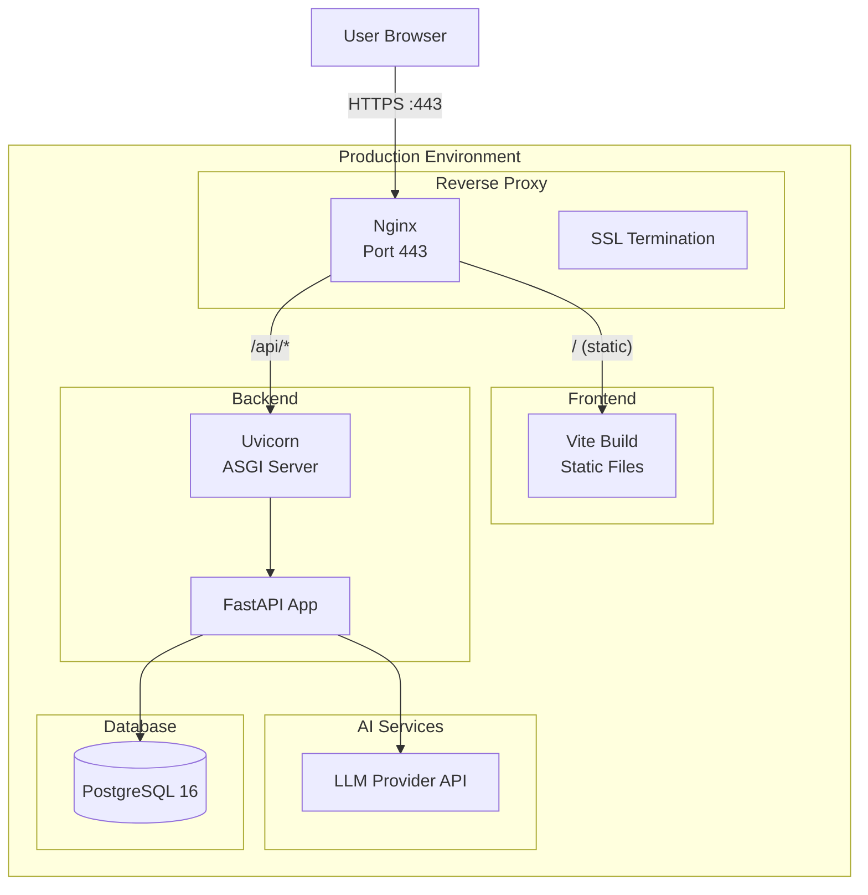
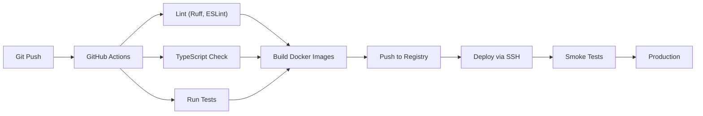

# AegisIQ — Infrastructure

> Docker, Nginx, CI/CD, and deployment configuration for the AegisIQ platform.

---

## Architecture



---

## Directory Structure

```
infrastructure/
├── docker/
│   ├── Dockerfile.frontend    Multi-stage React build
│   ├── Dockerfile.backend     Python FastAPI image
│   └── .dockerignore
├── nginx/
│   ├── nginx.conf             Production reverse proxy config
│   └── ssl/                   SSL certificates (not committed)
├── postgres/
│   ├── init.sql               Database initialization
│   └── postgresql.conf        Custom PostgreSQL configuration
├── monitoring/
│   ├── prometheus.yml         Prometheus config (future)
│   └── grafana-dashboards/    Grafana dashboards (future)
├── deployment/
│   ├── deploy.sh              Deployment script
│   ├── rollback.sh            Rollback script
│   └── healthcheck.sh         Health check endpoint test
└── backups/
    ├── backup.sh              Database backup script
    └── restore.sh             Database restore script
```

---

## Docker Compose

```yaml
services:
  frontend:
    build:
      context: ../frontend
      dockerfile: ../infrastructure/docker/Dockerfile.frontend
    ports:
      - "80:80"
    depends_on:
      - backend

  backend:
    build:
      context: ../backend
      dockerfile: ../infrastructure/docker/Dockerfile.backend
    ports:
      - "8000:8000"
    env_file: ../backend/.env
    depends_on:
      - postgres

  postgres:
    image: postgres:16-alpine
    volumes:
      - pgdata:/var/lib/postgresql/data
      - ./postgres/init.sql:/docker-entrypoint-initdb.d/init.sql
    environment:
      POSTGRES_DB: aegisiq
      POSTGRES_USER: aegisiq
      POSTGRES_PASSWORD: ${DB_PASSWORD}

volumes:
  pgdata:
```

---

## CI/CD Pipeline



---

## Environments

| Environment | URL | Purpose |
|---|---|---|
| `development` | `localhost` | Local development |
| `staging` | `staging.aegisiq.io` | Integration testing |
| `production` | `app.aegisiq.io` | Production |

---

## Getting Started

```bash
# Start all services
docker-compose up -d

# View logs
docker-compose logs -f

# Rebuild specific service
docker-compose up -d --build backend

# Stop all services
docker-compose down

# Reset database
docker-compose down -v
```

---

## Security

- All traffic over HTTPS (SSL termination at Nginx)
- Environment-based secrets (never in Dockerfiles)
- Non-root containers
- Database only accessible from backend
- Rate limiting at Nginx layer
- Health endpoint without sensitive data

---

## Backup & Recovery

```bash
# Backup database
./backups/backup.sh

# Restore database
./backups/restore.sh <backup_file>

# Automatic daily backup via cron
0 2 * * * /opt/aegisiq/infrastructure/backups/backup.sh
```
